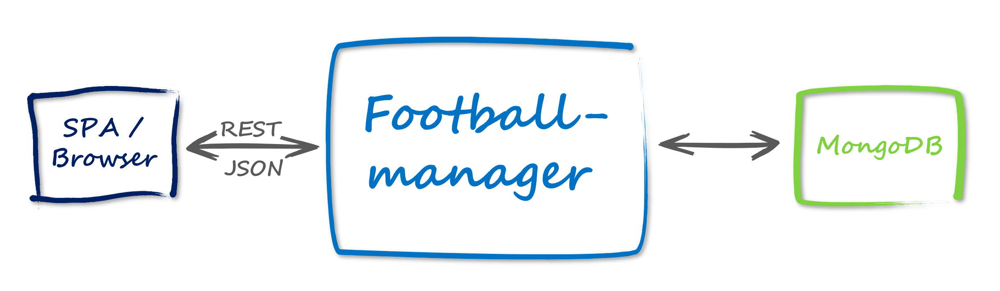

## Samples of JVM-Microframeworks using MongoDB written in Kotlin
This repo contains several examples of JVM-Microframeworks (e.g. [Micronaut](https://micronaut.io/), 
[Javalin](https://javalin.io/), [http4k](https://www.http4k.org/), [Ktor](https://ktor.io/), 
[Spring Fu](https://github.com/spring-projects/spring-fu), 
[Spark](http://sparkjava.com/), ...) written in [Kotlin](https://kotlinlang.org/) accessing a 
[MongoDB](https://www.mongodb.com/).

## Scenario 
All examples have this scenario in common:



This means they contain a _Footballmanager_ microservice which accesses a MongoDB and provides the data via REST/JSON.

## Setup
The MongoDB should be running on `mongodb://localhost:27017`and have a database `footballmanager`.
Within this database a collection `footballer` should provide documents of this kind:

```
{
  "_id" : ObjectId("5cc2d46f8735870692375404"),
  "firstName" : "Manuel",
  "lastName" : "Neuer",
  "position" : "Goalkeeper"
}
{
  "_id" : ObjectId("5cc2d4a08735870692375405"),
  "firstName" : "Antonio",
  "lastName" : "Rüdiger",
  "position" : "Defence"
}
{
  "_id" : ObjectId("5cc2d4c98735870692375406"),
  "firstName" : "Toni",
  "lastName" : "Kroos",
  "position" : "Midfield"
}
{
  "_id" : ObjectId("5cc2d5118735870692375407"),
  "firstName" : "Leroy",
  "lastName" : "Sane",
  "position" : "Striker"
}
```

## Projects

#### Micronaut

* See [micronaut-kotlin-mongodb](https://github.com/csh0711/jvm-microframeworks-kotlin-samples/tree/master/micronaut-kotlin-mongodb)

#### Javalin

* See [javalin-kotlin-mongodb](https://github.com/csh0711/jvm-microframeworks-kotlin-samples/tree/master/javalin-kotlin-mongodb)

#### Spring Fu

* See [spring-kofu-mongodb](https://github.com/csh0711/jvm-microframeworks-kotlin-samples/tree/master/spring-kofu-mongodb)

#### Ktor (basic example)

* See [ktor-mongodb-basic](https://github.com/csh0711/jvm-microframeworks-kotlin-samples/tree/master/ktor-mongodb-basic)

#### Ktor (advanced example)

* See [ktor-mongodb-advanced](https://github.com/csh0711/jvm-microframeworks-kotlin-samples/tree/master/ktor-mongodb-advanced)

#### http4k

* See [http4k-mongodb](https://github.com/csh0711/jvm-microframeworks-kotlin-samples/tree/master/http4k-mongodb)


#### Spark

* See [spark-kotlin-mongodb](https://github.com/csh0711/jvm-microframeworks-kotlin-samples/tree/master/spark-kotlin-mongodb)
